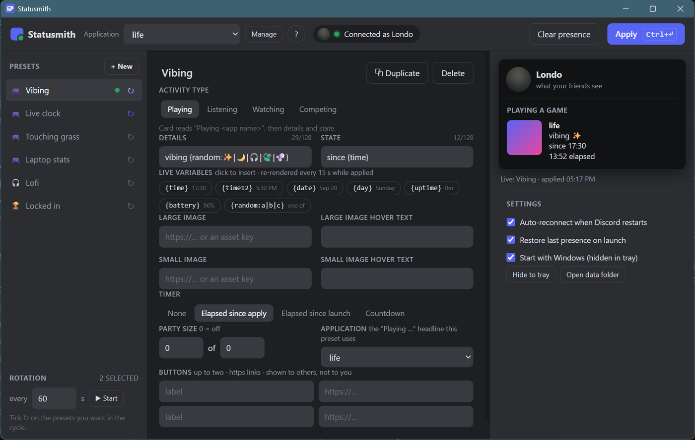

# Statusmith

A Windows tray app for writing your own Discord **Rich Presence** — the "Playing …" card with
details, state, images, timers, party size and buttons — and switching between saved presets
from the tray.

It talks to the Discord client already running on your machine over its local Rich Presence
pipe, exactly the way a game does. It never sees your account token.



## Features

- **Applications as headlines.** Each Discord application you create is one headline
  ("Playing *life*", "Listening to *lofi*", "Competing in *the rewrite*"). Pick the application
  in the top bar and you see just its presets.
- **Presets** with details, state, large/small image, hover text, party size and up to two link
  buttons. Edits save as you type.
- **Live preview** that mimics the Discord profile popout, with your own avatar once connected.
- **Activity types**: Playing, Listening, Watching, Competing.
- **Live variables**, re-rendered every 15 seconds while a preset is applied:

  | Variable | Example |
  |---|---|
  | `{time}` `{time12}` | `14:05` / `2:05 PM` |
  | `{date}` `{day}` | `Sep 20` / `Saturday` |
  | `{uptime}` | time since Statusmith started, `2h 14m` |
  | `{battery}` | `87%` |
  | `{random:a\|b\|c}` | one of the options, re-rolled each refresh |

- **Timers**: elapsed since apply, elapsed since launch, or a countdown that can restart when it
  ends. *Listening + countdown* draws a Spotify-style progress bar.
- **Images**: paste any `https://` image link, or use asset keys from the application's
  *Rich Presence → Art Assets* (they're offered as suggestions).
- **Rotation**: cycle through ticked presets every N seconds, across applications.
- **Tray**: apply any preset from the menu, start/stop rotation, clear, quit. Closing the window
  hides it; *Start with Windows* launches it hidden.
- **Auto-reconnect** when Discord restarts and **restore last presence** on launch — the elapsed
  timer even survives a reboot.

## Install

Windows 10/11 (uses the WebView2 runtime that ships with Windows).

1. Download `statusmith.exe` from the [latest release](https://github.com/Londopy/statusmith/releases/latest)
   and put it wherever you like.
2. Run it. Optional: `install_shortcut.ps1` next to the repo makes Start Menu and Desktop shortcuts.

Or build it yourself — see below.

## Setup

1. Open the [Discord Developer Portal](https://discord.com/developers/applications) and click
   **New Application**. Its **name** is what appears after "Playing" (or "Listening to",
   "Watching", "Competing in"), so name it what you want people to read. Make several if you like.
2. Optional: upload an **App Icon** — Discord shows it as the card tile when a preset has no
   large image. `app-icons/make_icons.py` is a small generator for flat icons if you want a
   starting point.
3. In Statusmith, **Manage** (top bar) → paste the **Application ID** from General Information.
   The name fills in by itself.
4. Pick a preset, hit **Apply** (`Ctrl+Enter`). The pill turns green with your name when the
   client accepts it.

Details and state must be at least two characters (Discord's rule); the editor warns you.
Buttons are shown to *other* people, not on your own card — that's Discord, not a bug.

## Is this allowed?

Yes. Rich Presence is a first-class Discord feature for third-party programs; the Developer Portal
exists so you can register them. Statusmith:

- talks only to your local Discord client over its IPC pipe — no requests to Discord's servers,
  and the client itself throttles presence updates to roughly one per 15 seconds;
- never has your token, so it cannot act as your account (the thing that actually gets people banned);
- makes two unauthenticated HTTP requests per application per launch (its public name and asset
  list), then nothing.

Nothing in the app can send presence faster than Discord's own guidance.

## Data

Presets, applications and settings live in `%APPDATA%\Statusmith\store.json` (there's an
*Open data folder* button in Settings). It's plain JSON — back it up, edit it, share it.

## Build

Needs Rust (stable), Node 20+, and the Visual Studio C++ build tools.

```bash
npm install
npm run build      # -> src-tauri\target\release\statusmith.exe
```

`npm run dev` runs a debug build with devtools. CI builds the exe on every push and attaches it to
`v*` tag releases (`.github/workflows/build.yml`).

## How it works

- `src-tauri/src/ipc.rs` — the Discord IPC protocol, ~150 lines, no crate: frames are an 8-byte
  little-endian header (opcode, length) plus JSON over `\\.\pipe\discord-ipc-N`. All I/O is
  synchronous on one handle, with reads gated by `PeekNamedPipe` (a blocking read on a duplicated
  handle deadlocks the writer on Windows).
- `src-tauri/src/main.rs` — Tauri commands, the tray menu (one submenu per application), close-to-tray,
  autostart, single-instance.
- `ui/` — plain HTML/CSS/JS, no bundler: presets, template variables, rotation, reconnect logic,
  the preview card.

Windows only for now; the pipe path and `PeekNamedPipe` are the only platform-specific parts, so a
Unix-socket (`$XDG_RUNTIME_DIR/discord-ipc-N`) port is a contained change if you want to send one.

## License

MIT — see [LICENSE](LICENSE).
